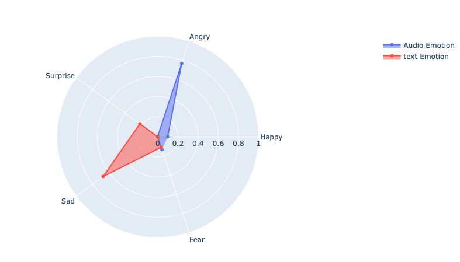
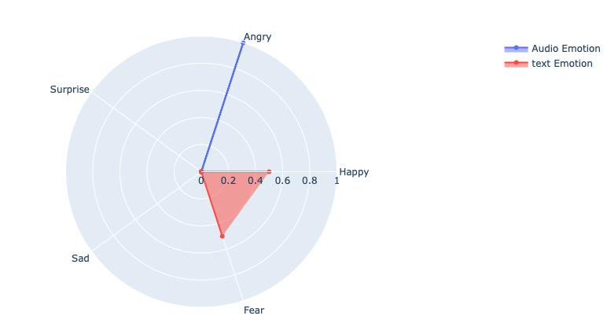

Check this [page](https://uazhlt-ms-program.github.io/technical-tutorial-tinageee/) for the GitHub Pages version of the tutorial.

# How to Compare the Emotions from Acoustic and Linguistic Features of a Speech

Although the literature on sentiment and emotion analyses is extensive, few rigorous investigations have documented the emotion synchrony between different modalities.

From this article, you will understand how to use this python package to extract the sentiments from speech and compare the emotions expressed from acoustics and conveyed from linguistics.

## Where can we use it?

### Deception detection:
Although deceivers can apply high-level control for behavioral management, many non-verbal behaviors are driven unconsciously. They cannot be perfectly controlled (Buller and Burgoon 1996), so deceivers can still leak deceptive cues through their voice and facial expression. Based on the premise that lying is cognitively more demanding than truth-telling, existing deception detection studies have examined behavioral patterns between deceivers and truth-tellers (Ekman,1969). Driving from the same theory, this excessive cognitive load could promote inconsistency between the emotion expressed by the deceiver’s linguistic and acoustic features.

<br/>**Reference**:
<br/>Buller, D.B. and Burgoon, J.K. 1996. “Interpersonal deception theory,” Communication theory (6:3), pp.203-242.
<br/>Ekman, P., & Friesen, W. V. 1969. Nonverbal leakage and clues to deception. Psychiatry, 32(1), 88–106

## Model basic information
### Input
- _An audio file_
- _The transcript of the audio_

### Output
- _A cosine similarity score_

### Usage
- _Test whether the emotion in the speaker's language and audio aligns_
### Natural languages supported
- _English_

## Steps:
1. Identify the emotions from the audio
2. Identify the emotions from the text
4. Compare two emotion tags

### Step 0: Set a Proper Environment

### Python Packages
- librosa==0.6.3
- numpy
- pandas
- soundfile==0.9.0
- wave
- sklearn
- tqdm==4.28.1
- matplotlib==2.2.3
- pyaudio==0.2.11

Install these libraries by the following command:
```
pip install -r requirements.txt
```
inputs
```
text="Although the literature on sentiment and emotion analyses is extensive, few rigorous investigations have documented
the emotion synchrony between different modalities. From this article, you will understand how to use this python package
to extract the sentiments from the speech and compare the emotion expressed from acoustic and conveyed from linguistic."

audio_file='data/audio_for_demo_1.wav'
```


### Step 1: Identify the Emotions from the Audio

Codes and data in this section are adapted and modified from [x4nth055](https://github.com/x4nth055).

<br/>_Project: [Emotion Recognition Using Speech](https://github.com/x4nth055/emotion-recognition-using-speech)_
<br/>_Copyright (c) 2019 [x4nth055](https://github.com/x4nth055)_
<br/>_License [MIT License]( https://github.com/x4nth055/emotion-recognition-using-speech/blob/master/LICENSE)_

Model development Dataset:
This  used 2 datasets (including this repo's custom dataset) which are downloaded and formatted already in the `data` folder:
- [**RAVDESS**](https://zenodo.org/record/1188976) : The **R**yson **A**udio-**V**isual **D**atabase of **E**motional **S**peech and **S**ong that contains 24 actors (12 male, 12 female), vocalizing two lexically-matched statements in a neutral North American accent.
- [**TESS**](https://tspace.library.utoronto.ca/handle/1807/24487) : **T**oronto **E**motional **S**peech **S**et that was modeled on the Northwestern University Auditory Test No. 6 (NU-6; Tillman & Carhart, 1966). A set of 200 target words were spoken in the carrier phrase "Say the word _____' by two actresses (aged 26 and 64 years).
- All the emotion notation were not marked by the audio content

Data Preprocessing and Feature Extraction:
- There are 9 emotions available in the dataset: "neutral", "calm", "happy" "sad", "angry", "fear", "disgust", "ps" (pleasant surprise) and "boredom". Here we only use 5 basic emotion categories: Happy, Angry, Sad, Surprise, and Fear.
- Feature extraction is the main part of the speech emotion recognition system. It is basically accomplished by changing the speech waveform to a form of parametric representation at a relatively lesser data rate.

Model training:
Apply RNN(LSTM) to train and test model
- LSTM: 128x2 two RNN layers with 128 unites
- Dense: 128x2 two Dense Layers with 128 units
- Dropout Rate: 0.3
- BatchSize: 64
- Epochs: 200
- The model's architecture, weights values, and `compile()` information were saved in `log` and `result` folder in H5 format
  
```python
from deep_emotion_recognition import DeepEmotionRecognizer
# initialize instance
# inherited from emotion_recognition.EmotionRecognizer
# default parameters (LSTM: 128x2, Dense:128x2)
deeprec = DeepEmotionRecognizer(emotions=['happy','angry', 'ps', 'sad', 'fear'],
                                n_rnn_layers=2, n_dense_layers=2, rnn_units=128, dense_units=128)
# train the model
deeprec.train()
```
Converting the raw audio to 16000 sample rate, mono channel
```python
from convert_wavs import convert_audio
import os
import ffmpeg

convert_audio(audio_file,"data/audio_for_demo_1_converted.wav")
```

For the purpose of this project, we are only looking for the predicting probabilities:
```python
audio_emotion=deeprec.predict_proba("data/audio_for_demo_1_converted.wav")
audio_emotion
```
**output:**
```
{'happy': 0.09773087, 'angry': 0.7660278, 'ps': 0.0029606828, 'sad': 6.4339074e-05, 'fear': 0.13321622}
```

### Step 2: Identify the Emotions from the Text
Python Package:[Text2Emotion](https://pypi.org/project/text2emotion/)
- Processes any textual data, recognizes the emotion embedded in it and provides the output in the form of a dictionary.
- Well suited with 5 basic emotion categories such as **Happy, Angry, Sad, Surprise, and Fear**.
- The output will be in the form of a dictionary where keys as emotion categories and values as emotion scores.
```python
import text2emotion as  te
text_emotion=te.get_emotion(text)
text_emotion
```
**output:**
```
{'Happy': 0.0, 'Angry': 0.0, 'Surprise': 0.22, 'Sad': 0.67, 'Fear': 0.11}
```

### Step 3. Compare Two Emotion Tags
Show the radar chat between two emotion results

```python
#modify emotion key name, make audio_emotion and text_emotion Key matches
audio_emotion['Happy'] = audio_emotion.pop('happy')
audio_emotion['Angry'] = audio_emotion.pop('angry')
audio_emotion['Surprise'] = audio_emotion.pop('ps')
audio_emotion['Sad'] = audio_emotion.pop('sad')
audio_emotion['Fear'] = audio_emotion.pop('fear')

def extra_dic_value (dict1):
    res = []
    for key in dict1.keys() :
        res.append(dict1[key])
    return res
    
import plotly.graph_objects as go

def plot_rader (audio_emotion,text_emotion):
    categories = ['Happy','Angry','Surprise','Sad','Fear']

    fig = go.Figure()

    fig.add_trace(go.Scatterpolar(
          r=extra_dic_value(audio_emotion),
          theta=categories,
          fill='toself',
          name='Audio Emotion'
    ))
    fig.add_trace(go.Scatterpolar(
          r=extra_dic_value(text_emotion),
          theta=categories,
          fill='toself',
          name='text Emotion'
    ))

    fig.update_layout(
      polar=dict(
        radialaxis=dict(
          visible=True,
          range=[0, 1]
        )),
      showlegend=True
    )

    fig.show()
```

```python
plot_rader(audio_emotion,text_emotion)
```
**output:**



Calculate the cosine similarity of two emotion sets
```python
import math

def cosine_dic(dic1,dic2):
    numerator = 0
    dena = 0
    for key1,val1 in dic1.items():
        numerator += val1*dic2.get(key1,0.0)
        dena += val1*val1
    denb = 0
    for val2 in dic2.values():
        denb += val2*val2
    return numerator/math.sqrt(dena*denb)
    
cosine_dic(audio_emotion,text_emotion)
```
**output:**
```
0.11596345652177634
```
- The emotions expressed from audio and the emotions are not aligned with each other.

**Test on other audio records**
```python
audio_file='data/audio_for_demo_2.wav'
text="I hope you got the idea about the basic functionalities provided by this program. If you have any questions, 
you are welcome to reach me by my email. All code shown here is in this GitHub repository. Feel free to leave a comment! Thank you!"

convert_audio(audio_file,"data/audio_for_demo_2_converted.wav")
audio_emotion=deeprec.predict_proba("data/audio_for_demo_2_converted.wav")
text_emotion=te.get_emotion(text)

print("Audio emotions:",audio_emotion)
print("Text emotions:",text_emotion)
```
**output:**
```
Audio emotions: {'happy': 0.09773087, 'angry': 0.7660278, 'ps': 0.0029606828, 'sad': 6.4339074e-05, 'fear': 0.13321622}
Text emotions: {'Happy': 0.5, 'Angry': 0.0, 'Surprise': 0.0, 'Sad': 0.0, 'Fear': 0.5}
```

```python
plot_rader(audio_emotion,text_emotion)
print("cosine similarity:=",cosine_dic(audio_emotion,text_emotion))
```

**output:**


```python
cosine similarity:= 0.0
```
- The emotions expressed from audio and the emotions are not aligned with each other.
### limitation:
- The input of the project is the audio and its transcript. It could be better to include an audio-to-text converter to reduce the input dimensions.
- The accuracy rate of the emotional recognizer is not ensured. The speech emotion classifier seems bias toward "angry".

### I hope you got the idea about the basic functionalities provided by this program. If you have any questions, you are welcome to reach me by [ge1@email.arizona.edu](ge1@email.arizona.edu)
### All code shown here is in [this GitHub repository](https://github.com/uazhlt-ms-program/technical-tutorial-tinageee.git). Feel free to leave a comment! Thank you!
